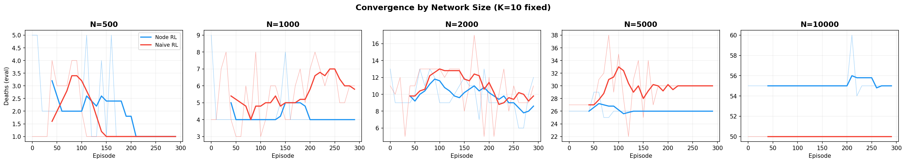
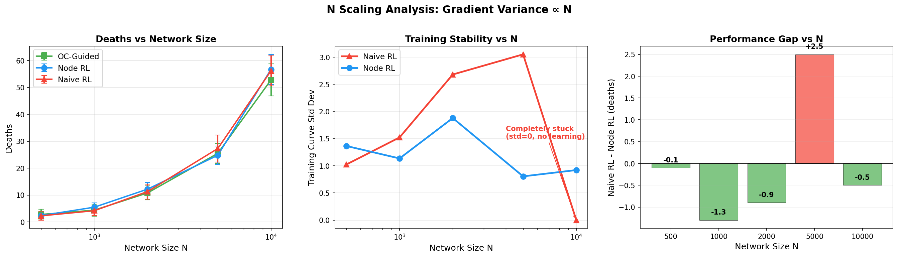
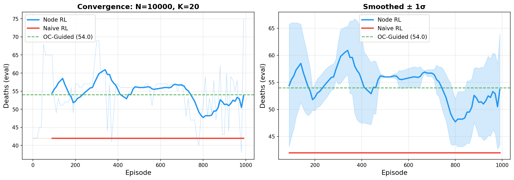
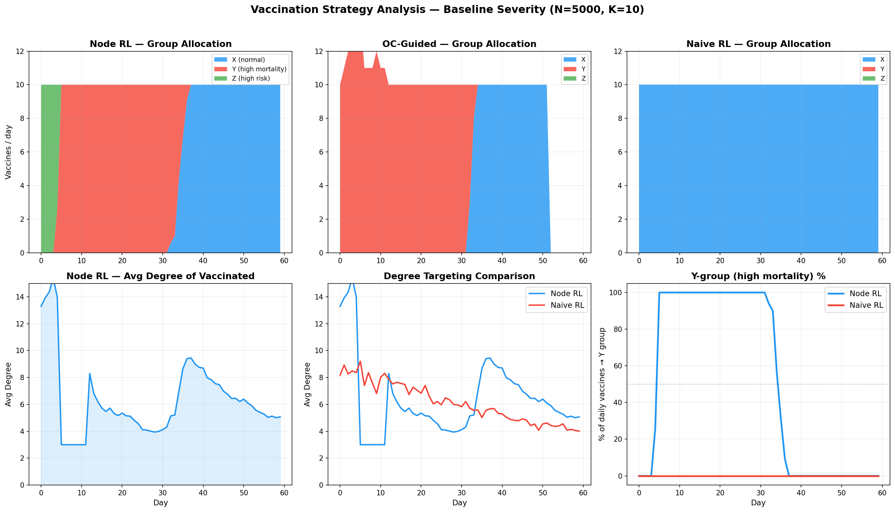

# Naive RL vs Node RL: Comprehensive Comparison

**Branch**: `naive-rl-comparison`  
**Date**: 2026-04-11 ~ 2026-04-12  
**Commits**: `61ab5ff`, `4762d92`

---

## 1. What We Did

### 1.1 Implemented True Naive RL (Bernoulli Policy)

Added `NaiveNodePolicy` in `rl/model.py` — a truly naive individual-level RL baseline:

- Each node's vaccination decision is an **independent Bernoulli**: `p_i = sigmoid(score_i)`, `a_i ~ Bernoulli(p_i)`
- **Projection to K**: if too many selected, keep K with highest `p_i`; if too few, add highest-`p_i` unselected nodes
- **Log-prob** = sum over all N nodes: `Σ [a_i log(p_i) + (1-a_i) log(1-p_i)]` — this sum has N terms, making gradient variance O(N)
- Same MLP architecture as Node RL (shared scorer) for fair comparison
- Added `run_training_naive_rl()` in `rl/train.py` with PPO training loop

**Key code**: `rl/model.py:159-276` (NaiveNodePolicy), `rl/train.py:683-917` (training loop)

### 1.2 Ran 6 Sensitivity Sweeps (3 methods × multiple settings)

All experiments compare **OC-Guided** vs **Node RL** (Gumbel-Top-K + terminal reward) vs **Naive RL** (Bernoulli + projection).

| Sweep | Variable | Values | Script |
|---|---|---|---|
| A. Severity | pY, dY | baseline, moderate, severe, critical | `experiments/naive_vs_node_comparison.py` |
| B. Beta | transmissibility | 0.04, 0.06, 0.08, 0.10, 0.12, 0.15 | same |
| C. V_MAX | daily vaccine budget K | 5, 10, 20, 40, 60 | same |
| D. Network | topology | BA, ER, WS, Regular | same |
| E. Discount | gamma | 0.80, 0.90, 0.95, 0.99, 1.00 | same |
| F. Horizon | episode length T | 30, 60 | same |

Config: N=5000, BA(m=3), 300 episodes, terminal_reward_scale=1.0

### 1.3 N Scaling Experiment

Tested N = 500, 1000, 2000, 5000, 10000 with K=10 fixed to validate gradient variance ∝ N theory.

**Script**: `experiments/n_scaling_comparison.py`

### 1.4 Runtime Comparison at Scale

N=10000, K=20, 1000 episodes, no early stopping. Records convergence history.

**Script**: `experiments/runtime_comparison.py`

### 1.5 Vaccination Plan Analysis

Analyzed per-day vaccination records (node IDs, group, degree) across methods.

**Script**: `experiments/analyze_vaccination_plans.py`

---

## 2. Key Results

### 2.1 Sensitivity Sweeps

#### Sweep A: Severity

| Scenario | OC-Guided | Node RL | Naive RL |
|---|---|---|---|
| Baseline (pY=0.2, dY=0.27) | 25.5 ± 3.7 | **23.8 ± 5.2** | 27.2 ± 5.7 |
| Moderate (pY=0.3, dY=0.40) | **60.5 ± 6.5** | 61.2 ± 5.2 | 62.5 ± 6.9 |
| Severe (pY=0.4, dY=0.50) | **91.2 ± 7.3** | 91.1 ± 9.1 | 97.7 ± 8.2 |
| Critical (pY=0.5, dY=0.65) | **149.4 ± 7.0** | 146.5 ± 10.1 | 155.7 ± 8.4 |

Node RL beats OC in baseline; Naive RL consistently worst (gap widens with severity).

#### Sweep B: Beta

| Beta | OC-Guided | Node RL | Naive RL |
|---|---|---|---|
| 0.04 | 14.8 ± 4.0 | **14.2 ± 5.8** | 14.3 ± 3.7 |
| 0.06 | 21.5 ± 3.2 | **20.1 ± 4.7** | 22.8 ± 3.4 |
| 0.08 | **25.5 ± 3.7** | 25.5 ± 4.2 | 27.2 ± 5.7 |
| 0.10 | **29.6 ± 4.4** | 31.5 ± 3.2 | 33.0 ± 5.6 |
| 0.12 | 36.0 ± 5.2 | 33.2 ± 6.2 | **30.9 ± 4.8** |
| 0.15 | **36.1 ± 7.2** | 38.2 ± 4.2 | 37.0 ± 5.2 |

Node RL outperforms OC at low beta where precise node targeting matters most.

#### Sweep C: V_MAX (K scaling)

| V_MAX | OC-Guided | Node RL | Naive RL |
|---|---|---|---|
| 5 | 27.6 ± 3.6 | **26.5 ± 2.2** | 28.5 ± 4.2 |
| 10 | **25.5 ± 3.7** | 27.2 ± 5.7 | 27.2 ± 5.7 |
| 20 | 22.4 ± 5.4 | **21.1 ± 5.6** | 28.5 ± 4.0 |
| 40 | 22.4 ± 6.9 | **21.6 ± 5.9** | 28.3 ± 5.2 |
| 60 | **20.4 ± 3.8** | 22.4 ± 2.4 | 25.2 ± 4.3 |

**Critical finding**: As K increases, Naive RL degrades (28.5 at K=20 vs Node RL 21.1 — gap of 7.4). More vaccines/day = more Bernoulli decisions = more gradient noise.

#### Sweep D: Network Type

| Network | OC-Guided | Node RL | Naive RL |
|---|---|---|---|
| BA | 25.5 ± 3.7 | **23.7 ± 3.4** | 27.2 ± 5.7 |
| ER | **20.0 ± 4.3** | 23.9 ± 4.8 | 25.4 ± 6.1 |
| WS | 22.7 ± 3.3 | **21.8 ± 4.0** | 24.2 ± 3.1 |
| Regular | **22.9 ± 5.5** | 26.4 ± 5.0 | 26.4 ± 5.0 |

Node RL best on BA and WS (heterogeneous degree / clustering); Naive RL worst everywhere.

#### Sweep E: Discount Factor (gamma)

| Gamma | OC-Guided | Node RL | Naive RL |
|---|---|---|---|
| 0.80 | **25.5 ± 3.7** | 28.4 ± 3.6 | 27.2 ± 5.7 |
| 0.90 | **25.5 ± 3.7** | 27.2 ± 5.7 | 27.2 ± 5.7 |
| 0.95 | 25.5 ± 3.7 | **24.1 ± 4.0** | 27.2 ± 5.7 |
| 0.99 | **25.5 ± 3.7** | 25.4 ± 4.8 | 27.2 ± 5.7 |
| 1.00 | 25.5 ± 3.7 | **22.6 ± 3.5** | 27.2 ± 5.7 |

**Strongest evidence**: Naive RL produces **identical 27.2 ± 5.7 at every gamma value** — the policy never learns, so changing the discount factor has zero effect. Node RL is best at gamma=1.0 (22.6, beating OC by 2.9).

#### Sweep F: Time Horizon

| Horizon | OC-Guided | Node RL | Naive RL |
|---|---|---|---|
| T=30 | 12.0 ± 3.2 | 11.1 ± 3.3 | **10.6 ± 1.9** |
| T=60 | **25.5 ± 3.7** | 28.7 ± 7.1 | 27.2 ± 5.7 |

At T=30 (shorter episodes), Naive RL does well because fewer Bernoulli decisions accumulate less gradient noise. At T=60, it reverts to its unlearned baseline.

### 2.2 N Scaling

| N | OC-Guided | Node RL | Naive RL |
|---|---|---|---|
| 500 | 2.8 ± 2.0 | 2.4 ± 1.2 | 2.3 ± 1.6 |
| 1,000 | 4.4 ± 2.2 | 5.5 ± 1.6 | 4.2 ± 1.8 |
| 2,000 | 10.8 ± 2.6 | 12.2 ± 2.5 | 11.3 ± 2.8 |
| 5,000 | 25.5 ± 3.7 | **24.8 ± 3.4** | 27.3 ± 5.0 |
| 10,000 | **52.8 ± 6.0** | 56.7 ± 5.6 | 56.2 ± 5.6 |

Final deaths don't show clean monotonic degradation, but **training dynamics** tell the real story:

| N | Naive RL training std | Node RL training std | Naive RL status |
|---|---|---|---|
| 500 | 1.02 | 1.36 | Learning normally |
| 1,000 | 1.52 | 1.14 | Learning, noisier |
| 2,000 | 2.68 | 1.88 | Barely learning, very noisy |
| 5,000 | 3.05 | 0.81 | Wild oscillation |
| 10,000 | **0.00** | 0.92 | **Completely frozen** |

Naive RL's training noise grows with N until it collapses entirely at N=10000 (std=0, policy never updates). Node RL remains stable across all N.

### 2.3 Runtime Comparison (N=10000, K=20, 1000 episodes)

| Method | Deaths | Runtime | Per-episode |
|---|---|---|---|
| OC-Guided | 54.0 ± 8.3 | **12.1s** | — |
| Node RL | **52.4 ± 6.6** | 572.4s | 0.57 s/ep |
| Naive RL | 56.3 ± 8.7 | 617.2s | 0.62 s/ep |

Per-episode cost is nearly identical (Bernoulli ops are vectorised). **The bottleneck is learnability, not computation.**

### 2.4 Vaccination Plan Analysis

#### Group Priority

| Method | Early phase (day 0-29) | Late phase (day 30-59) |
|---|---|---|
| **Node RL** | 85-93% Y group (high mortality) | 80-85% X group (normal) |
| **OC-Guided** | ~100% Y group | ~87% X group |
| **Naive RL** | **100% X group** | **100% X group** |

Node RL autonomously learns the same two-phase strategy as OC: **protect Y-group first (high mortality), then switch to X-group**. Naive RL never learns to vaccinate Y or Z groups.

#### Node Overlap

Jaccard similarity between Node RL and Naive RL ≈ **0.001** — they vaccinate completely different nodes.

#### Degree Targeting

- Node RL reaches hub nodes with degree up to 261; Naive RL max degree = 12
- Node RL shows high-degree targeting on day 1 (avg degree ≈ 14), then decreases
- Naive RL degree pattern is static across all scenarios (no learning)

---

## 3. Code Changes

### `rl/model.py`
- Added `NaiveNodePolicy` class (lines 159-276): independent Bernoulli sampling + projection to K, with O(N) gradient variance log-prob
- No changes to existing `NodeScoringPolicy` or `ActorCritic`

### `rl/train.py`
- Added `run_training_naive_rl()` function (lines 683-917): PPO training loop for NaiveNodePolicy with NaN-safe Bernoulli log-prob recomputation

### New experiment scripts
- `experiments/naive_vs_node_comparison.py` — 6-sweep comparison with plan logging
- `experiments/runtime_comparison.py` — N=10000 runtime benchmark
- `experiments/n_scaling_comparison.py` — N scaling (500-10000)
- `experiments/analyze_vaccination_plans.py` — vaccination plan analysis

---

## 4. Conclusions

1. **Naive RL fundamentally fails to learn at scale**: The N-dimensional Bernoulli log-prob creates gradient variance ∝ N that drowns the learning signal. Most clearly shown by identical results (27.2) across all gamma values and training collapse at N=10000.

2. **Node RL learns near-optimal strategies**: It independently discovers the OC-like two-phase vaccination strategy (Y-group first, then X-group) and targets high-degree hub nodes.

3. **The bottleneck is learnability, not computation**: Runtime per episode is similar (0.57 vs 0.62 s/ep), but learned policy quality differs vastly.

4. **K scaling confirms theory**: More vaccines/day worsens Naive RL (more Bernoulli decisions) but helps Node RL (top-K unaffected by K).

5. **N scaling shows progressive degradation**: Naive RL training noise grows with N (std: 1.0 → 3.05) until total collapse (std=0) at N=10000.
